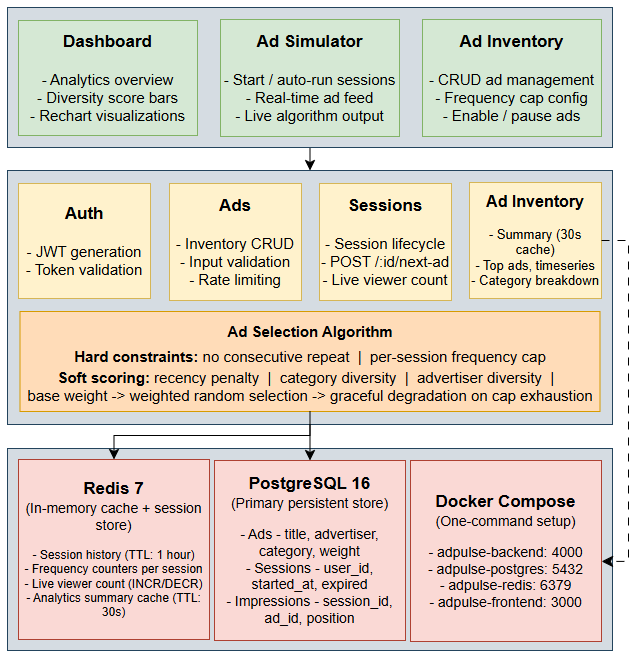

# AdPulse — Smart Ad Frequency & Diversity Engine

> A production-grade system that solves one of ad-supported streaming's core engineering challenges: delivering ads that feel thoughtful, not punishing.

---

## The Problem

Ad-supported streaming platforms like Tubi face a fundamental tension: **ads are the revenue model, but repetitive ads drive users away.** The #1 user complaint across free streaming services is seeing the same ad back-to-back, or the same advertiser dominating a session.

This isn't just a UX problem — it's a business problem. A user who quits a session early due to ad fatigue generates zero ad revenue for the remaining time they would have watched.

**AdPulse** is a full-stack system that sits between content playback and ad serving. It enforces intelligent frequency caps, diversity constraints, and session-aware ad rotation — ensuring users experience natural ad variety while advertisers receive fair, measurable exposure.

---

## Architecture Overview



All services are containerized and orchestrated with **Docker Compose**.

---

## Key Design Decisions

### 1. Redis as the session state layer (not PostgreSQL)

Each call to `POST /sessions/:id/next-ad` needs the full session history to run the selection algorithm. Fetching this from PostgreSQL on every request would add a multi-row query + join on every ad serve — expensive at scale.

Instead, session history is written to Redis on every impression and read from Redis on every request. Redis is the **fast path**; PostgreSQL is the **durable path**. If a Redis key expires (TTL = 1 hour), the system reconstructs history from the impressions table (cache miss fallback).

This is the same pattern used in high-throughput ad systems where session state needs sub-millisecond reads.

### 2. Constraint-based algorithm over ML

A machine learning recommendation model would require training data, a model serving layer, and retraining pipelines — significant infrastructure for a system that needs to be reliable and auditable.

Instead, AdPulse uses a **constraint-based scoring algorithm** with explicit, readable rules:

- **Hard constraints** (disqualify entirely): no consecutive repeats, frequency caps
- **Soft constraints** (score modifiers): recency penalty, category diversity window, advertiser diversity window, base weight
- **Weighted random selection** from scored candidates (prevents deterministic cycling)

This is more debuggable, instantly tunable by non-ML engineers, and has no cold-start problem. In production, a hybrid approach (ML for personalization + constraint layer for frequency hygiene) would be ideal — noted in future improvements.

### 3. Graceful degradation on frequency cap exhaustion

If all ads in the pool have hit their session frequency caps, the algorithm relaxes the cap constraint and retries rather than returning an error. The response includes a `selectionReason: "frequency_cap_relaxed"` field so the caller is informed. This ensures the system always serves an ad even in edge cases.

### 4. Impressions written to both Redis and PostgreSQL in one request

When an ad is served, the impression is recorded in PostgreSQL (durable, queryable) AND appended to the Redis session history in the same request handler. This keeps both stores in sync without a separate worker process, at the cost of a slightly slower response (~2 extra async writes). At Tubi-scale, this would move to a message queue (e.g., Kafka) where the HTTP response returns immediately and a consumer handles persistence asynchronously.

### 5. Analytics caching with short TTL

The `GET /analytics/summary` endpoint aggregates across potentially thousands of sessions and impressions. This query is expensive and doesn't need real-time precision — a 30-second cache in Redis is sufficient. The cache is also explicitly invalidated when ads are created, updated, or deleted.

---

## API Reference

### Auth
| Method | Endpoint | Description |
|--------|----------|-------------|
| POST | `/api/auth/token` | Generate JWT for a userId |

### Ads
| Method | Endpoint | Description |
|--------|----------|-------------|
| GET | `/api/ads` | List all ads with impression stats |
| GET | `/api/ads/:id` | Get a single ad |
| POST | `/api/ads` | Create an ad (auth required) |
| PATCH | `/api/ads/:id` | Update ad settings (auth required) |
| DELETE | `/api/ads/:id` | Delete an ad (auth required) |

### Sessions
| Method | Endpoint | Description |
|--------|----------|-------------|
| POST | `/api/sessions` | Start a new session |
| GET | `/api/sessions/live-count` | Get live viewer count from Redis |
| GET | `/api/sessions/:id` | Get session + impression history |
| POST | `/api/sessions/:id/next-ad` | **Serve next optimal ad** |
| DELETE | `/api/sessions/:id` | Expire a session |

### Analytics
| Method | Endpoint | Description |
|--------|----------|-------------|
| GET | `/api/analytics/summary` | Full analytics summary (cached 30s) |
| GET | `/api/analytics/top-ads` | Top ads by impression count |
| GET | `/api/analytics/categories` | Impressions by category |
| GET | `/api/analytics/timeseries` | Impressions over time |

---

## Setup & Running

### Prerequisites
- [Docker](https://www.docker.com/get-started) and Docker Compose

### One-command startup

```bash
git clone https://github.com/YOUR_USERNAME/adpulse.git
cd adpulse
docker compose up --build
```

This will:
1. Start PostgreSQL and Redis
2. Run database migrations
3. Seed 17 realistic ads and 5 historical sessions
4. Start the Node.js backend on `http://localhost:4000`
5. Start the React frontend on `http://localhost:3000`

**Open `http://localhost:3000`** — the dashboard loads immediately with seeded data.

### Running tests

```bash
cd backend
npm install
npm test
```

---

## Project Structure

```
adpulse/
├── backend/
│   ├── src/
│   │   ├── db/
│   │   │   ├── index.js          # PostgreSQL pool
│   │   │   ├── redis.js          # Redis client
│   │   │   ├── migrate.js        # Schema creation
│   │   │   └── seed.js           # Dev data seeder
│   │   ├── middleware/
│   │   │   ├── auth.js           # JWT verification
│   │   │   └── errorHandler.js   # Global error handler
│   │   ├── routes/
│   │   │   ├── ads.js
│   │   │   ├── sessions.js
│   │   │   ├── analytics.js
│   │   │   └── auth.js
│   │   ├── services/
│   │   │   ├── adSelection.js    # Core algorithm
│   │   │   ├── sessionService.js # Redis + DB session management
│   │   │   └── analyticsService.js
│   │   ├── utils/
│   │   │   └── logger.js         # Winston logger
│   │   └── index.js              # Express app entry
│   ├── tests/
│   │   └── adSelection.test.js   # Algorithm unit tests
│   ├── Dockerfile
│   └── package.json
├── frontend/
│   ├── src/
│   │   ├── pages/
│   │   │   ├── Dashboard.js      # Analytics overview
│   │   │   ├── Simulator.js      # Live ad delivery demo
│   │   │   └── Inventory.js      # Ad management
│   │   ├── services/
│   │   │   └── api.js            # Axios API layer
│   │   ├── App.js
│   │   └── index.css
│   ├── Dockerfile
│   └── package.json
└── docker-compose.yml
```

---

## Tradeoffs & Future Improvements

| Area | Current Approach | Production Improvement |
|------|-----------------|----------------------|
| **Event persistence** | Synchronous DB write per impression | Async Kafka/SQS consumer — HTTP returns immediately |
| **Session reconstruction** | Full history from impressions table | Materialized session snapshots |
| **Ad selection** | Constraint-based scoring | Hybrid: ML personalization + constraint layer for frequency hygiene |
| **Auth** | Simple JWT with dev secret | OAuth 2.0 / SSO integration |
| **Analytics** | 30s Redis cache | Pre-computed materialized views via scheduled aggregation worker |
| **Frequency caps** | Per-session | Per-day, per-week caps across sessions |
| **A/B testing** | Not implemented | Experiment framework for algorithm variant testing |
| **Observability** | Winston logs | Distributed tracing (OpenTelemetry), Prometheus metrics, Grafana dashboards |

---

## Tech Stack

| Layer | Technology |
|-------|-----------|
| Frontend | React 18, React Router, Recharts, Axios |
| Backend | Node.js 20, Express 4 |
| Database | PostgreSQL 16 |
| Cache / Session | Redis 7 |
| Auth | JSON Web Tokens (jsonwebtoken) |
| Validation | express-validator |
| Logging | Winston + Morgan |
| Rate limiting | express-rate-limit |
| Testing | Jest + Supertest |
| Containerization | Docker + Docker Compose |

---

*Built by Pari Patel*
